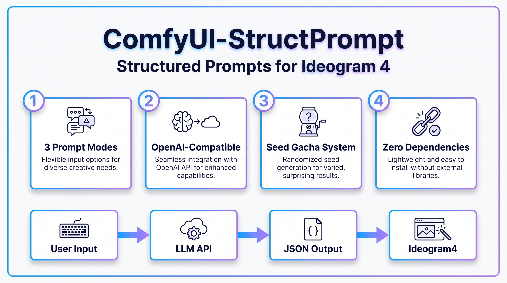

# ComfyUI-StructPrompt

<p align="center">
  
</p>

为 [Ideogram 4](https://github.com/ideogram-oss/ideogram4) 设计的 ComfyUI 自定义节点，通过任意 **OpenAI 兼容 API** 生成严格合规的结构化 JSON 提示词。

## 功能特点

- **3 种提示词模式**：普通扩写、详细描述、JSON 修复
- **抽卡系统**：`seed` 参数控制扩写方向，同一句话可生成不同风格的丰富描述
- **严格合规**：输出格式完全遵循 Ideogram 4 官方 JSON Schema，包括严格的 key 顺序、bbox 坐标顺序、hex 颜色格式等
- **通用 OpenAI 兼容接口**：支持任意 OpenAI-compatible API（MiniMax、OpenAI、OneAPI、自定义代理等）
- **零依赖**：仅使用 Python 标准库，无需额外安装包
- **安全**：API Key 和 Base URL 仅通过环境变量配置，不暴露前端 widget，分享 PNG 不会泄露密钥

## 样张展示

点击缩略图查看原图与提示词。

<p align="center">
  <a href="assets/A1.png" title="点击查看原图">
    
  </a>
  &nbsp;&nbsp;
  <a href="assets/A2.png" title="点击查看原图">
    
  </a>
</p>

<details>
<summary>📝 A1 提示词（点击展开）</summary>

A young East Asian woman in flowing white hanfu stands on a high mountain balcony above a sea of clouds, photographed in a cinematic widescreen composition. She has long black hair partially gathered up with a delicate gold hair ornament, fair porcelain skin, refined classical features, a gentle warm smile as she gazes out across the vast horizon. She wears a layered ivory-white traditional hanfu with subtle silver embroidery, wide flowing sleeves drifting in the wind, cinched at the waist with a dark navy sash and an ornate brass buckle, a sword with a gold-trimmed hilt hanging at her hip.

The background reveals a breathtaking high-altitude landscape — an endless sea of rolling white clouds below, traditional red-walled temple pavilions with curved dark-tile roofs nestled on a distant mountain peak piercing through the mist, layered blue mountain silhouettes fading into the horizon, a soft pastel dawn sky overhead with wispy cirrus clouds.

Cinematic horizontal composition 16:9, the figure anchored on the right third of the frame from the upper thighs to above the crown, leaving the left two-thirds as vast negative space filled with the cloud sea and distant temples, creating a powerful sense of scale and solitude. Soft warm golden-hour sunlight illuminates her face and the white fabric from the left, casting delicate luminous highlights while preserving the cool blue tones of the distant landscape. Color palette: ivory and silver hanfu, navy sash, brass gold accents, soft dawn gold light, cool cloud white, deep mountain blue, distant vermillion temple walls. Atmosphere: tranquil, transcendent, heroic — a quiet martial artist at peace above the world, the moment before a journey. Cinematic xianxia portrait photography, epic fantasy mood, soft natural dawn light, hyper-detailed costume texture.

</details>

<details>
<summary>📝 A2 提示词（点击展开）</summary>

A young East Asian woman in flowing sage-green hanfu rides a massive silver-white scaled dragon perched on a mossy boulder in a misty ancient forest ravine. She has long flowing black hair with a delicate silver hair ornament, fair porcelain skin, refined features, calm composed expression with downcast eyes. She wears layered pale-green traditional robes with wide sleeves, a coral-red sash at the waist, brass ornaments, wrist guards. Her hands are raised slightly, channeling wisps of luminous pale-green magical energy that swirl around her fingers.

The dragon beneath her is enormous and ancient — pearl-white scales catching the light, a flowing ivory mane and whiskers, curved horns, fierce golden eyes, fanged jaw slightly open. The dragon's long scaled body coils along the rock, its tail extending into the right side of the frame.

Cinematic horizontal composition 16:9, the woman and dragon anchored slightly right of center on the boulder, the left third filled with deep forest ravine — towering moss-covered rock walls, hanging vines, fern undergrowth in the foreground, misty depth fading into blue distance. Soft cool diffused light filters down through the canopy, casting gentle highlights on the dragon's scales and the woman's green robes, while deep shadows fill the ravine. Color palette: sage green robes, ivory dragon scales, deep moss green, charcoal rock, cool misty blue. Atmosphere: mystical, ancient, serene — a hidden moment of communion between rider and beast in a sacred forest. Cinematic xianxia fantasy illustration, soft volumetric forest lighting, hyper-detailed scale and fabric texture.

</details>

## 节点列表

### LLM JSON Prompt (Advanced)

核心节点，支持 3 种模式生成 Ideogram4 结构化 JSON 提示词。

**输入参数：**

| 参数 | 类型 | 必填 | 说明 |
|---|---|---|---|
| `user_prompt` | STRING | ✅ | 输入内容。根据模式不同，可以是简单描述、长文本、或 JSON |
| `mode` | 下拉框 | ✅ | **普通扩写**：简单描述 → AI 自动丰富细节<br>**详细描述**：长文本/反推提示词 → 结构化 JSON<br>**JSON修复**：不完整/错误的 JSON → 修复为合规格式 |
| `seed` | INT | ✅ | 抽卡种子（0-999999）。普通扩写模式下换 seed 会生成不同风格 |
| `model` | STRING | ✅ | 默认 `MiniMax-M3`。可输入任意模型名，如 `gpt-4o`、`claude-3-5-sonnet` |
| `temperature` | FLOAT | ✅ | 默认 0.6。越高越有创意，越低越稳定 |
| `max_tokens` | INT | ✅ | 默认 4096。提示词很长时可加大 |

**输出：**

| 输出 | 类型 | 说明 |
|---|---|---|
| `ideogram4_prompt` | STRING | 生成的 Ideogram4 合规 JSON 字符串 |
| `mode_used` | STRING | 当前使用的模式名称 |

### LLM JSON Prompt

旧版单模式节点，兼容旧工作流。直接调用 LLM API 生成提示词。

### Ideogram4 Param Builder

参数预设构建器，输出 Default / Quality / Turbo 三种预设的 steps、mu、std 等参数。

## 3 种模式详解

### 普通扩写

适合场景：你只有简单的想法，想让 AI 自动扩展出丰富的画面细节。

输入示例：
```
古风少女在樱花树下弹琴
```

MiniMax 会自动扩写：氛围、光线、构图、色彩、质感、环境叙事等。`seed` 参数可切换不同扩写方向（光影/质感/色彩/构图等），实现抽卡效果。

### 详细描述

适合场景：你已有详细的自然语言描述（或从 Midjourney、DALL-E、MiniMax 网页版等平台反推的提示词），需要转换成 Ideogram4 的严格 JSON 格式。

**规则**：严格保留原文所有细节，不增删、不改写、不扩展。

### JSON 修复

适合场景：你有一个不完整、格式错误、或字段缺失的 JSON，需要修复为 Ideogram4 合规格式。

**规则**：
- 尽量保留原有内容不变
- 修复 bbox 坐标、hex 颜色格式、缺失字段
- 删除多余字段
- 如果输入是纯自然语言，则转换为结构化 JSON

## 安装 / 部署

### 方法 1：直接复制（推荐）

```bash
cd /path/to/ComfyUI/custom_nodes
cp -r /path/to/ComfyUI-StructPrompt ./
```

### 方法 2：Git 克隆

```bash
cd /path/to/ComfyUI/custom_nodes
git clone <你的仓库地址> ComfyUI-StructPrompt
```

### 重启 ComfyUI

浏览器刷新界面，或重启 ComfyUI 服务。在节点搜索框输入 `LLM` 或 `JSON` 即可找到节点。

**无需安装额外依赖**，插件仅使用 Python 标准库（`json`, `os`, `urllib`）。

## API Key & 接口配置

**出于安全考虑，前端已移除 `api_key` 输入框，所有敏感配置通过环境变量或本地配置文件读取。**

这是为了防止 ComfyUI 将 API Key 序列化到 PNG 图片的元数据中，导致密钥泄露。

### 配置方式（二选一）

#### 方式 1：环境变量（推荐，适合 systemd / Docker 部署）

```bash
export MINIMAX_BASE_URL="https://api.minimaxi.com"
export MINIMAX_API_KEY="sk-你的-key"
```

其他 OpenAI 兼容接口：
```bash
export OPENAI_BASE_URL="https://api.openai.com/v1"
export OPENAI_API_KEY="sk-你的-key"
```

#### 方式 2：本地配置文件（适合直接复制安装，无需改系统环境）

在插件目录 `ComfyUI-StructPrompt/` 下创建 `config.json`：

```json
{
    "base_url": "https://api.minimaxi.com",
    "api_key": "sk-你的-key",
    "default_model": "MiniMax-M3",
    "default_temperature": 0.6,
    "default_max_tokens": 4096
}
```

参考 `config.json.example` 模板复制修改即可。

### 配置优先级

1. **环境变量**（最高优先级）
   - `OPENAI_BASE_URL` → `MINIMAX_BASE_URL`
   - `OPENAI_API_KEY` → `MINIMAX_API_KEY`
2. **本地 `config.json`**（插件目录下）
3. **内置默认值**（`https://api.minimaxi.com`）

> ⚠️ `config.json` 包含真实密钥，**不要随工作流或 tar.gz 分享**。分享时只包含 `config.json.example` 模板。

## 工作流连接示例

```
CR Prompt Text (用户输入)
    │
    ▼
LLM JSON Prompt (Advanced)
    │
    ├──────► ShowText|pysssss (显示生成的 JSON，方便查看)
    │
    └──────► CLIPTextEncode (作为 Ideogram4 的正向提示词输入)
                  │
                  ▼
            Ideogram4 生图流程
```

## 技术细节

- **Text Encoder**：Ideogram 4 使用 Qwen3-VL-8B-Instruct，上下文窗口 131K tokens，支持极长的 JSON 提示词
- **BBox 坐标顺序**：官方格式为 `[y_min, x_min, y_max, x_max]`（非 `[x_min, y_min, x_max, y_max]`）
- **Key 顺序**：严格遵循官方 Prompting Guide，与训练分布一致
- **JSON 序列化**：使用紧凑格式 `separators=(",", ":")`，更接近训练分布
- **Color Palette**：整体最多 16 色，每个 element 最多 5 色
- **API 协议**：标准 OpenAI Chat Completions 格式，兼容任意 LLM 服务商

## 文件说明

```
ComfyUI-StructPrompt/
├── __init__.py              # 入口文件
├── nodes.py                 # 节点定义（无敏感信息，可安全分享）
├── llm_client.py            # LLM API 客户端
├── pyproject.toml           # ComfyUI 管理器识别配置
├── README.md                # 本文件
├── config.json.example      # 配置模板
├── workflow-example.json    # 工作流示例
└── assets/                  # 图片资源
    ├── comfyui_structprompt_infographic.png
    ├── A1.png
    └── A2.png
```

## 分享注意事项

1. **API Key 安全**：本节点已移除前端 `api_key` 输入框，所有敏感配置仅通过环境变量读取，不会随 PNG 图片或工作流泄露
2. **通用可分享**：代码中无任何硬编码的 URL 或密钥，接收方配置自己的环境变量即可使用任意 OpenAI 兼容 API
3. **不要泄露个人隐私**：工作流 JSON 中可能包含你的提示词历史，分享前请检查
4. **标准库-only**：接收方无需安装额外 Python 包，直接解压到 `custom_nodes` 即可使用

## 更新日志

### v0.2.0
- **安全修复**：彻底移除前端 `api_key` widget，防止 PNG 元数据泄露 API Key
- **通用 LLM 接口**：支持任意 OpenAI-compatible API
- **环境变量配置**：`OPENAI_BASE_URL` / `MINIMAX_BASE_URL` + `OPENAI_API_KEY` / `MINIMAX_API_KEY`
- 节点代码零硬编码，可安全分享

### v0.1.0
- 初始版本
- 支持 3 种模式：普通扩写、详细描述、JSON 修复
- 支持 seed 抽卡
- 严格遵循 Ideogram 4 官方 JSON Schema
